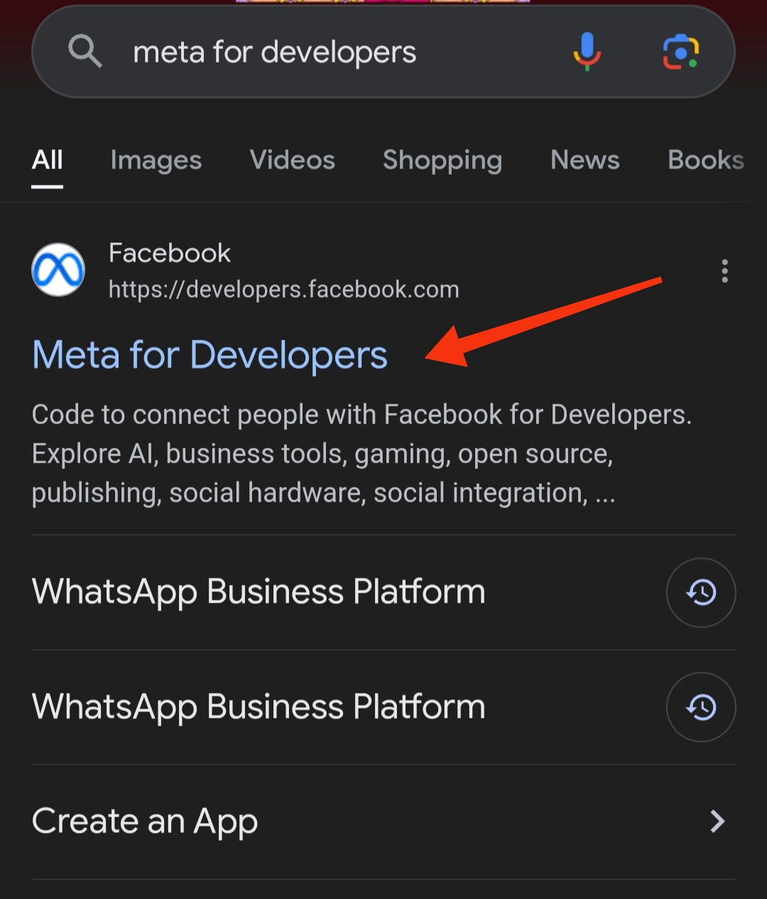
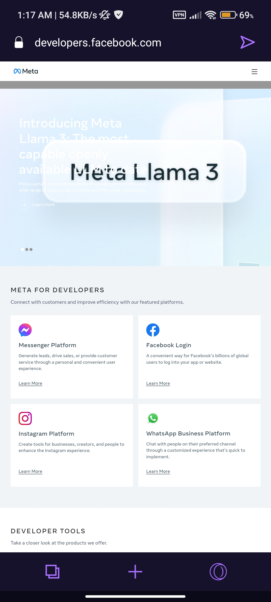
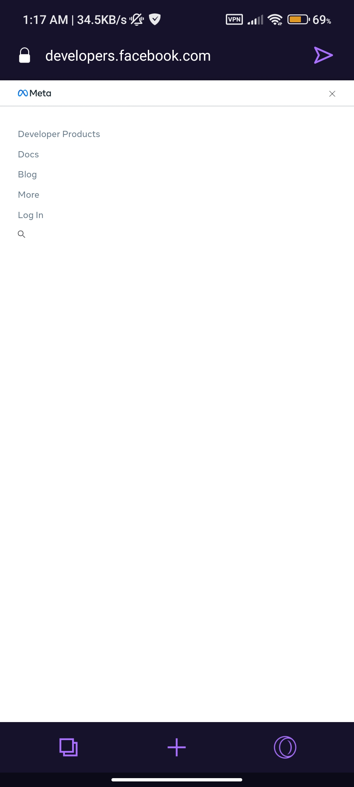
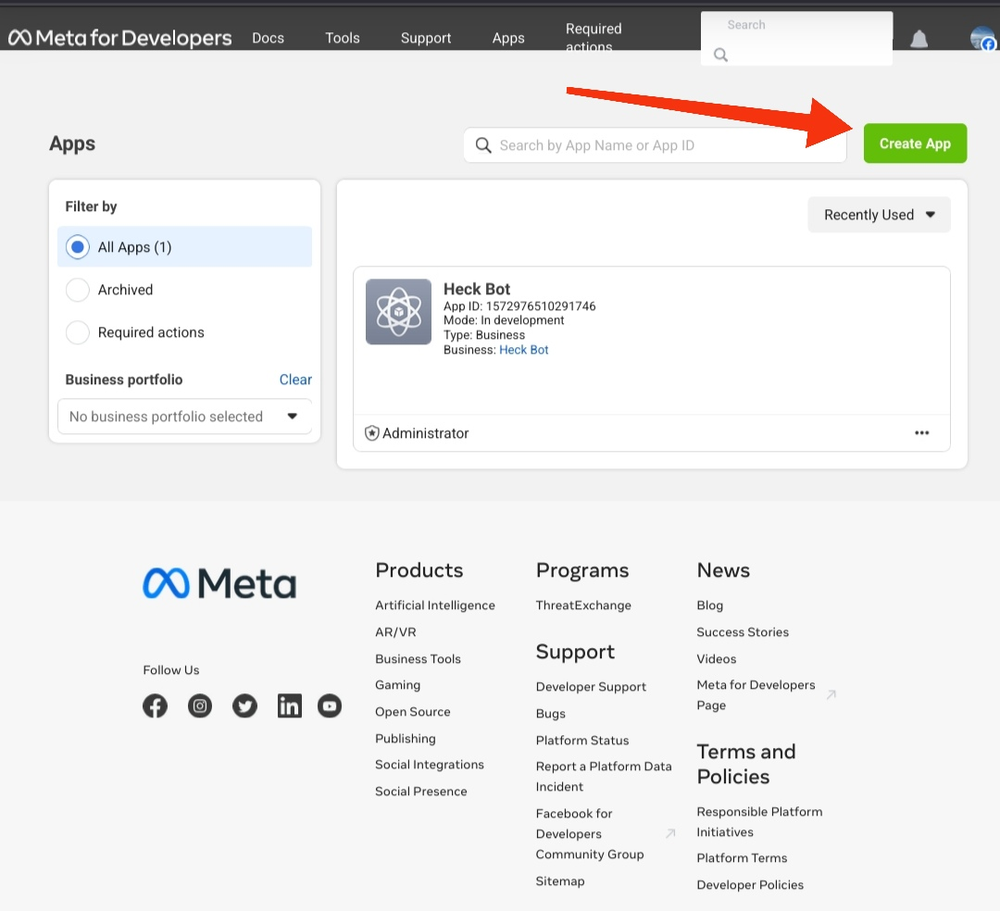
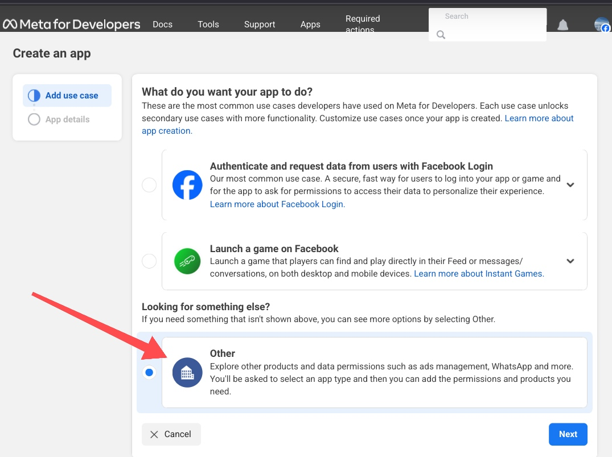

# Whatsapp_Gemini_Bot
**Get Google Gemini AI On Whtasapp, without port forwarding. An always online whatsapp bot by creating a flask server on vercel.**

## Only 4 Simple Steps:

#### 1)Get Whatsapp cloud api key
#### 2)Get Gemini api key
#### 3)Fork this repo to your account
#### 4)Put both api keys in your main.py code

## Step-1 Get Whatsapp api key

### •Search "meta for developers" in Google and open the first website.

### •Click "login" and login using your Facebook account 

### •When logged in, the login button become "Get started" button. Click on that and register for a developer account.

### •After creating a developer account, Click "Create app"

### •On the next window, select"other" option.

