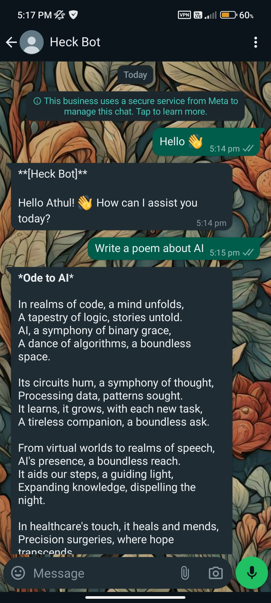
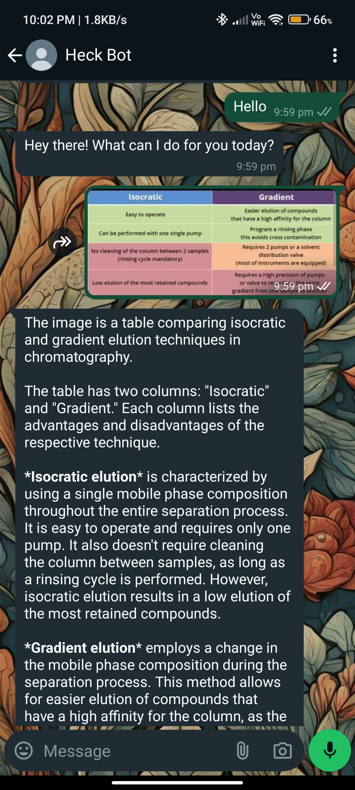
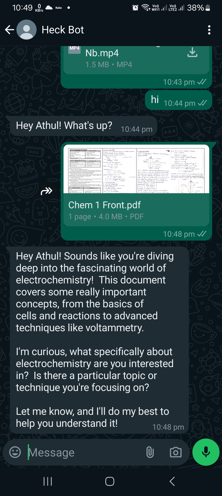

#### Please give a ⭐ if you like it.

### Follow the video tutorial to set up the bot 🤩👇

### ⚠️ Don't clone. It won't work in Local environment. Follow the steps in the video.

# Whatsapp_Gemini_Bot
**Get Google Gemini AI On WhatsApp, without port forwarding. An always online WhatsApp bot by creating a flask server on Vercel.**

## Complete tutorial video:

## Image Examples:

## 👆Bot can respond to images and audio

## Bot can respond to pdf also.
